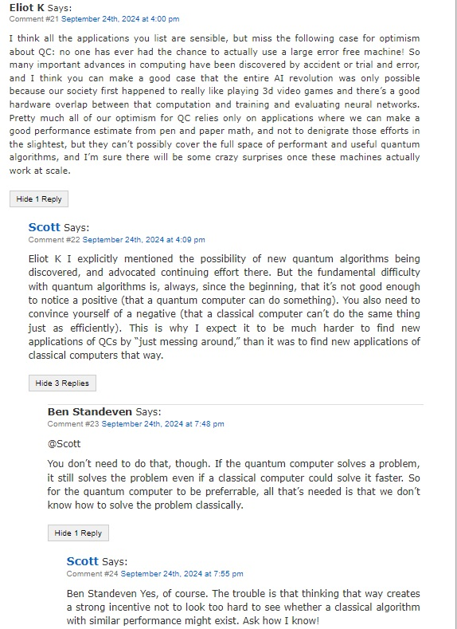

# Shtetl comment optimized
A chrome extension for readers of Scott Aaronson's blog "[Shtetl Optimized](https://scottaaronson.blog/)" .
The comment section is quite basic and makes it hard to follow threads of comments.
This extension finds explicit references to previous comments (i.e. "Comment #37 Joe:") and reorganizes the comment section in a threaded collapsible view to make it easier to read and follow discussions. 

## Installation

- ```git clone https://github.com/eliovi/shtetl-comment-optimized.git```
- In chrome, open chrome://extensions/
- Enable developer mode
- Drag Shtetl-comment-optimized directory into the chrome window

## Screenshot


